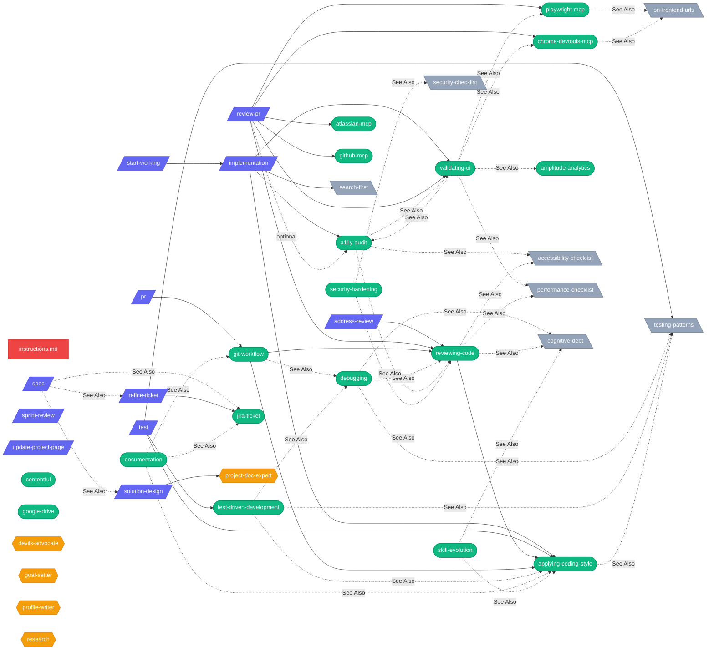

# ai-shared — Central AI Configuration

This folder is the single source of truth for all AI agent configuration — skills, prompts, agents, and global instructions. Other tools (Copilot, Codex, OpenCode) consume this via symlinks.

## Dependency Graph

How components connect — prompts trigger skills, skills reference each other, references serve as shared checklists.



**Legend:** <span style="color:#ef4444">■</span> Core · <span style="color:#6366f1">■</span> Prompts · <span style="color:#10b981">■</span> Skills · <span style="color:#f59e0b">■</span> Agents · <span style="color:#94a3b8">■</span> References — solid arrows = loads/uses, dashed arrows = See Also

## Structure

```
~/.ai-shared/
├── instructions.md       # Global rules (verification, decisions, quality)
├── skills/               # Reusable domain skills (loaded on demand)
│   ├── a11y-audit/             # Build & review UI for accessibility
│   ├── amplitude-analytics/    # Query Amplitude analytics data
│   ├── atlassian-mcp/          # Jira + Confluence via MCP
│   ├── applying-coding-style/  # Personal code writing standards
│   ├── chrome-devtools-mcp/    # Debug runtime issues via DevTools
│   ├── contentful/             # Read Contentful CMS (MCP + CLI)
│   ├── debugging/              # 5-step bug triage workflow
│   ├── documentation/          # ADRs, READMEs, technical docs
│   ├── git-workflow/           # Full git & PR pipeline
│   ├── github-mcp/             # GitHub operations via MCP
│   ├── google-drive/           # Fetch Google Sheets/Docs
│   ├── jira-ticket/            # Write, review, update tickets
│   ├── playwright-mcp/         # Browser automation via Playwright
│   ├── reviewing-code/         # 4-layer heuristic code review
│   ├── security-hardening/     # OWASP, auth, secrets, dependencies
│   ├── skill-evolution/        # Learn, stage, codify reusable skills
│   ├── test-driven-development/ # Test-driven development cycle
│   └── validating-ui/          # Browser-level UI validation
├── agents/               # Custom agent modes
│   ├── devils-advocate.agent.md
│   ├── goal-setter.agent.md
│   ├── profile-writer.agent.md
│   ├── project-doc-expert.agent.md
│   └── research.agent.md
├── prompts/              # Slash-command prompts (development lifecycle)
│   ├── spec.prompt.md              # Define — clarify what to build
│   ├── solution-design.prompt.md   # Plan — technical design
│   ├── implementation.prompt.md    # Build — implement a ticket
│   ├── start-working.prompt.md     # Build — full delivery workflow
│   ├── pr.prompt.md                # Ship — commit, push, create PR
│   ├── address-review.prompt.md    # Ship — triage review comments
│   ├── review-pr.prompt.md         # Review — full PR review against ticket
│   ├── test.prompt.md              # Test — run or write tests
│   ├── refine-ticket.prompt.md     # Define — pre-refinement review
│   ├── sprint-review.prompt.md     # Report — generate and email sprint review PDFs
│   └── update-project-page.prompt.md # Ship — update Confluence
├── references/           # Shared checklists (referenced by skills)
│   ├── accessibility-checklist.md
│   ├── cognitive-debt.md
│   ├── error-messages.md
│   ├── on-frontend-urls.md
│   ├── performance-checklist.md
│   ├── search-first.md
│   ├── security-checklist.md
│   └── testing-patterns.md
├── docs/                 # Contributor documentation
│   └── skill-anatomy.md         # Format spec for writing skills
└── research/             # Research-specific skills
    └── skills/
```

## Symlinks

All tools point back here. **Never edit the symlinked copies — always edit the source in `~/.ai-shared/`.**

| Source (ai-shared)    | Symlink target                                     | Tool            | Notes                                                                                                                         |
| --------------------- | -------------------------------------------------- | --------------- | ----------------------------------------------------------------------------------------------------------------------------- |
| `instructions.md`     | `~/.github/copilot-instructions.md`                | VS Code Copilot | Auto-loaded every conversation                                                                                                |
| `instructions.md`     | `~/.codex/instructions.md`                         | Codex           | Auto-loaded every conversation                                                                                                |
| `instructions.md`     | `~/.config/opencode/AGENTS.md`                     | OpenCode        | Global rules file; OpenCode reads `AGENTS.md` not `instructions.md`                                                           |
| `skills/`             | `~/.copilot/skills/`                               | VS Code Copilot | Directory symlink; skills loaded on demand via `<skills>` block                                                               |
| `skills/*`            | `~/.codex/skills/*` (per-skill symlinks)           | Codex           | Requires per-skill symlinks; no directory symlink support                                                                     |
| `skills/`             | `~/.config/opencode/skills/`                       | OpenCode        | Directory symlink; on-demand loading                                                                                          |
| `agents/`             | `~/.copilot/agents/`                               | VS Code Copilot | Copilot + OpenCode; Codex does not support custom agents                                                                      |
| `agents/`             | _(not symlinked)_                                  | OpenCode        | **Not compatible** — OpenCode agents require different frontmatter (`mode`, `model`, `permission` object) and `.md` extension |
| `prompts/`            | `~/Library/Application Support/Code/User/prompts/` | VS Code Copilot | Slash-command prompts; VS Code reads from its own user data folder                                                            |
| `prompts/`            | `~/.codex/prompts/`                                | Codex           | Slash-command prompts                                                                                                         |
| `prompts/*.prompt.md` | `~/.config/opencode/commands/*.md` (per-file)      | OpenCode        | Renamed symlinks; `implementation.prompt.md` → `/implementation`                                                              |
| `research/skills/`    | `~/.copilot/research/skills/`                      | VS Code Copilot | Copilot only — research agent skills                                                                                          |

## Rules for agents

- **Creating/updating skills, prompts, or agents**: always write to `~/.ai-shared/...` — symlinks propagate automatically.
- **Adding a new prompt**: create `~/.ai-shared/prompts/<name>.prompt.md`, then run `./setup.sh` so OpenCode per-command symlinks are refreshed.
- **Adding a new skill**: create `~/.ai-shared/skills/<name>/SKILL.md`, then add a per-skill symlink to `~/.codex/skills/`.
- **Global instructions**: edit `~/.ai-shared/instructions.md` — all tools pick up changes.
- This folder is git-tracked. Commit changes to preserve them.

## Skill authoring checklist

There are two skill families in this repo:

1. **Workflow skills** — process-heavy skills like `debugging`, `reviewing-code`, `test-driven-development`, `git-workflow`
2. **Tool skills** — tool-adapter skills like `contentful`, `playwright-mcp`, `atlassian-mcp`

Every skill SKILL.md must have:

1. **YAML frontmatter** with `name` and `description` (description includes trigger phrases)
2. **An H1 title**
3. **At least one substantive H2 section** — for example `When to Use`, `Procedure`, `Tool Selection`, `Rules`, or `Guardrails`
4. **Clear activation guidance** — either an explicit `When to Use` section or equivalent trigger language in the description/body

Workflow skills should usually also have:

1. **Common Rationalizations**
2. **Red Flags**
3. **Verification**
4. **See Also**

Tool skills may use a leaner format when that is clearer. For those, `Tool Selection`, `Procedure`, `Rules`, and mutation guardrails are often more useful than forcing the full workflow template.

See [docs/skill-anatomy.md](docs/skill-anatomy.md) for the full format spec with examples.

## Secrets

This repo is **public**. Never commit credentials, tokens, or passwords directly in skill/agent/prompt files.

Secrets are stored in a local `.secrets` file in `~/.ai-shared/.secrets`, which is gitignored. This is the shared AI config repo, not the target project workspace. Skills should reference this path explicitly so agents do not look for secrets in the app repo they are currently editing.

**After cloning, create your own `.secrets` file:**

```bash
cp .secrets.example .secrets
# Edit .secrets with your actual values
```

Format (`KEY=VALUE`, one per line):

```
STAGING_USER=...
STAGING_PASS=...
```

When writing or updating skills that need credentials, reference `~/.ai-shared/.secrets` with variable names — never hardcode values.

## Validation

Run `./validate.sh` after making changes to catch broken symlinks, missing frontmatter, minimum skill structure issues, empty files, and duplicate names.

When you add a new prompt or skill, run:

```bash
./setup.sh
./validate.sh
```
