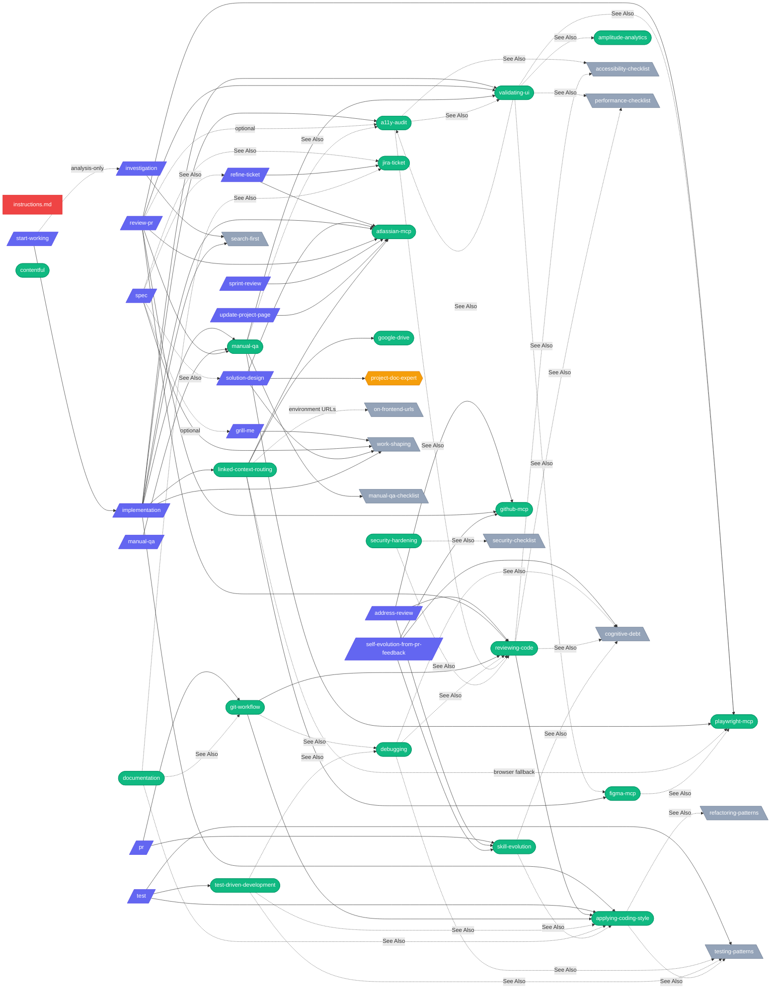
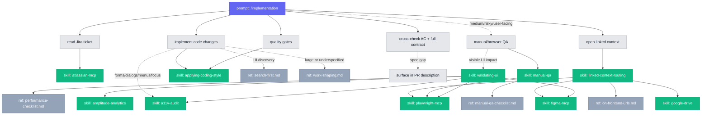
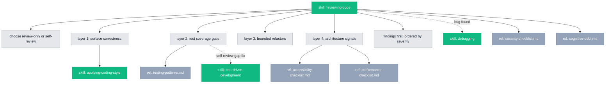
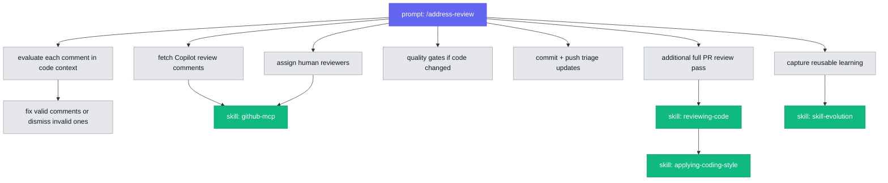

# ai-shared — Central AI Configuration

Single source of truth for skills, prompts, agents, and global instructions consumed by VS Code Copilot, Codex, OpenCode, and Claude Code via symlinks.

## What this is

One folder, four tools. Edit here, every agent picks it up:

- **Global instructions** — rules every conversation loads (`instructions.md`)
- **Skills** — reusable, on-demand domain behavior (`skills/`)
- **Prompts** — slash commands that orchestrate skills (`prompts/`)
- **Agents** — custom agent modes (`agents/`)
- **References** — shared checklists skills pull from (`references/`)
- **Self-evolution** — scheduled jobs that mine PR feedback and research (`self-evolution/`)

## Quick start

```bash
git clone <repo> ~/.ai-shared
cd ~/.ai-shared
cp .secrets.example .secrets   # fill in local credentials (gitignored)
./setup.sh                     # create all symlinks for Copilot/Codex/OpenCode/Claude
./validate.sh                  # catch broken symlinks, frontmatter issues, empty files
```

That's it. All four tools now read from this repo.

## Daily workflow

1. Edit files in `~/.ai-shared/` (never the symlinked copies)
2. If you added a new prompt/skill/agent file, run `./setup.sh` to refresh per-file symlinks
3. Run `./validate.sh`
4. Commit — agents consume the update on the next conversation

**Common edits**

| You want to…                       | Edit this                                     |
| ---------------------------------- | --------------------------------------------- |
| Change a global rule for all tools | `instructions.md`                             |
| Add reusable behavior              | `skills/<name>/SKILL.md`                      |
| Add a slash command                | `prompts/<name>.prompt.md`                    |
| Add a custom agent mode            | `agents/<name>.agent.md`                      |
| Share a checklist between skills   | `references/<name>.md`                        |

## Structure

```
~/.ai-shared/
├── instructions.md       # Global rules (verification, decisions, quality)
├── skills/               # Reusable domain skills (loaded on demand)
│   ├── a11y-audit/             # Build & review UI for accessibility
│   ├── amplitude-analytics/    # Query Amplitude analytics data
│   ├── atlassian-mcp/          # Jira + Confluence via MCP
│   ├── applying-coding-style/  # Personal code writing standards
│   ├── contentful/             # Read Contentful CMS (MCP + CLI)
│   ├── debugging/              # 5-step bug triage workflow
│   ├── documentation/          # ADRs, READMEs, technical docs
│   ├── figma-mcp/              # Read Figma designs via MCP before browser fallback
│   ├── git-workflow/           # Full git & PR pipeline
│   ├── github-mcp/             # GitHub operations via MCP
│   ├── google-drive/           # Fetch Google Sheets/Docs
│   ├── jira-ticket/            # Write, review, update tickets
│   ├── linked-context-routing/ # Route mixed linked resources to the right integration
│   ├── manual-qa/              # Plan and execute manual QA from ticket and diff
│   ├── playwright-mcp/         # Browser automation via Playwright
│   ├── reviewing-code/         # 4-layer heuristic code review
│   ├── security-hardening/     # OWASP, auth, secrets, dependencies
│   ├── skill-evolution/        # Learn, stage, codify reusable skills
│   ├── test-driven-development/ # Test-driven development cycle
│   └── validating-ui/          # Browser-level UI validation
├── self-evolution/       # Internal research automation and run history
│   ├── policy.md               # Shared source registry, scoring, dedupe
│   ├── runner.sh               # Automation runner
│   └── jobs/
│       ├── self-evolution-from-pr-feedback/ # Weekly on-frontend PR feedback mining
│       │   ├── command.md          # Autonomous PR feedback self-evolution workflow
│       │   ├── job.json            # Monday 10:00 scheduler + model config
│       │   └── run-log.jsonl       # Run history and dedupe state
│       ├── research/
│       │   ├── command.md      # Autonomous research workflow
│       │   ├── job.json        # Scheduler + model config
│       │   ├── rotation.json   # Day-by-day focus rotation
│       │   ├── run-log.jsonl   # Run history and dedupe state
│       │   └── modes/          # Internal research playbooks, not top-level skills
│       │       ├── copilot-and-agents.md
│       │       ├── release-watch.md
│       │       ├── research-digest.md
│       │       └── tool-evaluator.md
│       └── research-pr-triage/
│           ├── command.md      # Conservative open research PR cleanup
│           ├── job.json        # Daily 15:00 scheduler + model config
│           └── run-log.jsonl   # PR triage decisions
├── agents/               # Custom agent modes
│   ├── devils-advocate.agent.md
│   ├── goal-setter.agent.md
│   ├── profile-writer.agent.md
│   ├── project-doc-expert.agent.md
│   └── research.agent.md
├── prompts/              # Slash-command prompts (development lifecycle)
│   ├── grill-me.prompt.md          # Define — alignment interview before spec
│   ├── spec.prompt.md              # Define — clarify what to build
│   ├── solution-design.prompt.md   # Plan — technical design
│   ├── implementation.prompt.md    # Build — implement a ticket
│   ├── start-working.prompt.md     # Build — full delivery workflow
│   ├── investigation.prompt.md     # Analyze — time-boxed spike/research workflow
│   ├── manual-qa.prompt.md         # QA — plan and execute manual QA
│   ├── pr.prompt.md                # Ship — commit, push, create PR
│   ├── address-review.prompt.md    # Ship — triage review comments
│   ├── review-pr.prompt.md         # Review — full PR review against ticket
│   ├── self-evolution-from-pr-feedback.prompt.md # Improve — convert PR feedback into guardrails
│   ├── test.prompt.md              # Test — run or write tests
│   ├── refine-ticket.prompt.md     # Define — pre-refinement review
│   ├── sprint-review.prompt.md     # Report — generate and email sprint review PDFs
│   └── update-project-page.prompt.md # Ship — update Confluence
├── references/           # Shared checklists (referenced by skills)
│   ├── accessibility-checklist.md
│   ├── cognitive-debt.md
│   ├── manual-qa-checklist.md
│   ├── on-frontend-urls.md
│   ├── performance-checklist.md
│   ├── refactoring-patterns.md
│   ├── search-first.md
│   ├── security-checklist.md
│   ├── testing-patterns.md
│   └── work-shaping.md
├── docs/                 # Contributor documentation
│   ├── context-audit.md        # ai-shared-only content hygiene guide
│   └── skill-anatomy.md        # Format spec for writing skills
```

## Content Layers

The physical folders are organized by primitive (`skills`, `prompts`, `agents`, `references`). The content itself has different scopes. Keep those scopes explicit so the shared core does not quietly fill with one-off workflows.

| Layer | What belongs here | Current examples | Maintenance rule |
| --- | --- | --- | --- |
| Core | Cross-repo rules, reusable workflows, reusable tool adapters, and checklists that should work beyond one team or project. | `instructions.md`, most `skills/*`, `docs/skill-anatomy.md`, shared references such as `testing-patterns.md` and `security-checklist.md` | Keep small and evergreen. Prefer skills/references over expanding global instructions. |
| Team-specific | Workflows tied to On, DSC, on-frontend, internal hosts, board IDs, preview auth, or team reporting habits. | `prompts/sprint-review.prompt.md`, `prompts/start-working.prompt.md`, `references/on-frontend-urls.md`, `self-evolution/jobs/self-evolution-from-pr-feedback/` | Make the scope obvious in the description/body. Keep hardcoded IDs visible, dated, and easy to audit. |
| Personal | Oktay-specific career, writing, preference, or taste guidance. Useful locally, but not automatically reusable by another engineer. | `agents/goal-setter.agent.md`, `agents/profile-writer.agent.md`, `skills/applying-coding-style/` | Keep factual source material separate from reusable process rules when it grows. Review for stale personal facts. |
| Automation | Scheduled or autonomous jobs that maintain this repo or mine feedback. | `self-evolution/runner.sh`, `self-evolution/jobs/research/`, `self-evolution/jobs/self-evolution-from-pr-feedback/` | Log outcomes, isolate worktrees, and keep generated evidence out of always-loaded context. |

## Content Hygiene

Use this when adding or simplifying content, not just when adding/removing files.

| Content smell | Prefer |
| --- | --- |
| Same instruction repeated in multiple prompts | Move the rule into a skill or reference and link to it. |
| Long prompt that teaches reusable behavior | Extract the behavior into a skill; keep the prompt as orchestration. |
| Hardcoded team/project IDs without scope | Mark the file as team-specific and include the source of truth/date. |
| Personal facts mixed with generic writing process | Split stable process rules from personal source material. |
| Mermaid graph updated for every tiny file | Keep the graph high-level; update the structure table for inventory. |
| Always-on global rule for a rare task | Move it to an on-demand skill, prompt, or reference. |

When content feels heavy, first decide whether the problem is scope, duplication, or staleness. Delete only after the rule, workflow, or source of truth has a better home or is no longer used.

## Symlinks

All tools point back here. **Never edit the symlinked copies — always edit the source in `~/.ai-shared/`.**

| Source (ai-shared)    | Symlink target                                     | Tool            | Notes                                                                                                                         |
| --------------------- | -------------------------------------------------- | --------------- | ----------------------------------------------------------------------------------------------------------------------------- |
| `instructions.md`     | `~/.github/copilot-instructions.md`                | VS Code Copilot | Auto-loaded every conversation                                                                                                |
| `instructions.md`     | `~/.codex/instructions.md`                         | Codex           | Auto-loaded every conversation                                                                                                |
| `instructions.md`     | `~/.config/opencode/AGENTS.md`                     | OpenCode        | Global rules file; OpenCode reads `AGENTS.md` not `instructions.md`                                                           |
| `instructions.md`     | `~/.claude/CLAUDE.md`                              | Claude Code     | Global user instructions file                                                                                                 |
| `skills/`             | `~/.copilot/skills/`                               | VS Code Copilot | Directory symlink; skills loaded on demand via `<skills>` block                                                               |
| `skills/*`            | `~/.codex/skills/*` (per-skill symlinks)           | Codex           | Requires per-skill symlinks; no directory symlink support                                                                     |
| `skills/`             | `~/.config/opencode/skills/`                       | OpenCode        | Directory symlink; on-demand loading                                                                                          |
| `skills/`             | `~/.claude/skills/`                                | Claude Code     | Directory symlink; SKILL.md naming matches                                                                                    |
| `agents/`             | `~/.copilot/agents/`                               | VS Code Copilot | Copilot + OpenCode; Codex does not support custom agents                                                                      |
| `agents/`             | _(not symlinked)_                                  | OpenCode        | **Not compatible** — OpenCode agents require different frontmatter (`mode`, `model`, `permission` object) and `.md` extension |
| `agents/*.agent.md`   | `~/.claude/agents/*.md` (per-file)                 | Claude Code     | Renamed symlinks; `.agent.md` → `.md`                                                                                         |
| `prompts/`            | `~/Library/Application Support/Code/User/prompts/` | VS Code Copilot | Slash-command prompts; VS Code reads from its own user data folder                                                            |
| `prompts/`            | `~/.codex/prompts/`                                | Codex           | Slash-command prompts                                                                                                         |
| `prompts/*.prompt.md` | `~/.config/opencode/commands/*.md` (per-file)      | OpenCode        | Renamed symlinks; `implementation.prompt.md` → `/implementation`                                                              |
| `prompts/*.prompt.md` | `~/.claude/commands/*.md` (per-file)               | Claude Code     | Renamed symlinks; `implementation.prompt.md` → `/implementation`                                                              |
| `references/`         | `~/.claude/references/`                            | Claude Code     | Directory symlink; shared checklists                                                                                          |

## Rules for agents

- **Creating/updating skills, prompts, or agents**: always write to `~/.ai-shared/...` — symlinks propagate automatically.
- **Adding a new prompt**: create `~/.ai-shared/prompts/<name>.prompt.md`, then run `./setup.sh` so OpenCode and Claude per-command symlinks are refreshed.
- **Adding a new skill**: create `~/.ai-shared/skills/<name>/SKILL.md`, then run `./setup.sh` so Codex per-skill symlinks are refreshed.
- **Adding a new agent**: create `~/.ai-shared/agents/<name>.agent.md`, then run `./setup.sh` so Claude per-agent symlinks are refreshed.
- **Global instructions**: edit `~/.ai-shared/instructions.md` — all tools pick up changes.
- This folder is git-tracked. Commit changes to preserve them.

## Skill authoring checklist

There are two skill families in this repo:

1. **Workflow skills** — process-heavy skills like `debugging`, `reviewing-code`, `test-driven-development`, `git-workflow`
2. **Tool skills** — tool-adapter skills like `contentful`, `playwright-mcp`, `atlassian-mcp`

Every skill SKILL.md must have:

1. **YAML frontmatter** with `name` and `description` (description includes trigger phrases)
2. **An H1 title**
3. **At least one substantive H2 section** — for example `When to Use`, `Procedure`, `Tool Selection`, `Rules`, or `Guardrails`
4. **Clear activation guidance** — either an explicit `When to Use` section or equivalent trigger language in the description/body

Workflow skills should usually also have:

1. **Common Rationalizations**
2. **Red Flags**
3. **Verification**
4. **See Also**

Tool skills may use a leaner format when that is clearer. For those, `Tool Selection`, `Procedure`, `Rules`, and mutation guardrails are often more useful than forcing the full workflow template.

See [docs/skill-anatomy.md](docs/skill-anatomy.md) for the full format spec with examples.

## Secrets

This repo is **public**. Never commit credentials, tokens, or passwords directly in skill/agent/prompt files.

Secrets are stored in a local `.secrets` file in `~/.ai-shared/.secrets`, which is gitignored. This is the shared AI config repo, not the target project workspace. Skills should reference this path explicitly so agents do not look for secrets in the app repo they are currently editing.

**After cloning, create your own `.secrets` file:**

```bash
cp .secrets.example .secrets
# Edit .secrets with your actual values
```

Format (`KEY=VALUE`, one per line):

```
STAGING_USER=...
STAGING_PASS=...
```

When writing or updating skills that need credentials, reference `~/.ai-shared/.secrets` with variable names — never hardcode values.

## Validation

Run `./validate.sh` after making changes to catch broken symlinks, missing frontmatter, minimum skill structure issues, empty files, and duplicate names.

When you add a new prompt or skill, run:

```bash
./setup.sh
./validate.sh
```

## Architecture

<details>
<summary><strong>Core dependency graph</strong> — how prompts, skills, agents, and references connect</summary>

This graph is a relationship map, not the exhaustive inventory. Keep it focused on stable, reusable flows and update the `Structure` and `Content Layers` sections for file-level additions or scope changes. Add a node here only when a file introduces a new relationship that future maintainers need to understand.



**Legend:** <span style="color:#ef4444">■</span> Core · <span style="color:#6366f1">■</span> Prompts · <span style="color:#10b981">■</span> Skills · <span style="color:#f59e0b">■</span> Agents · <span style="color:#94a3b8">■</span> References — solid arrows = loads/uses, dashed arrows = See Also

</details>

<details>
<summary><strong>Frequent flow trees</strong> — `/implementation`, `/review-pr`, `reviewing-code`, `/address-review`</summary>

These trees show the practical dependency chain for the prompts and skills used most often. Solid edges are part of the normal path; dashed edges are conditional branches based on ticket/PR shape, UI impact, or review mode.

### `/implementation`



### `/review-pr`

```mermaid
flowchart TD
  classDef prompt fill:#6366f1,stroke:#4f46e5,color:#fff
  classDef skill fill:#10b981,stroke:#059669,color:#fff
  classDef ref fill:#94a3b8,stroke:#64748b,color:#fff
  classDef action fill:#e5e7eb,stroke:#9ca3af,color:#111827

  ReviewPr["prompt: /review-pr"]:::prompt
  Context["context gathering"]:::action
  Coverage["AC coverage check"]:::action
  CodeReview["code review"]:::action
  Validation["functional validation"]:::action
  Verdict["review verdict"]:::action

  ReviewPr --> Context --> GH["skill: github-mcp"]:::skill
  Context --> Atlas["skill: atlassian-mcp"]:::skill
  Context --> Preview["preview URL + CI state"]:::action
  ReviewPr --> Coverage
  ReviewPr --> CodeReview --> Reviewing["skill: reviewing-code"]:::skill
  Reviewing --> Style["skill: applying-coding-style"]:::skill
  Reviewing --> TestRef["ref: testing-patterns.md"]:::ref
  Reviewing --> SecRef["ref: security-checklist.md"]:::ref
  Reviewing --> A11yRef["ref: accessibility-checklist.md"]:::ref
  Reviewing --> PerfRef["ref: performance-checklist.md"]:::ref
  Reviewing --> CogRef["ref: cognitive-debt.md"]:::ref
  ReviewPr --> Validation --> MQA["skill: manual-qa"]:::skill
  MQA --> MQARef["ref: manual-qa-checklist.md"]:::ref
  Validation -. visible UI change .-> UIVal["skill: validating-ui"]:::skill
  UIVal --> A11y["skill: a11y-audit"]:::skill
  UIVal --> Pw["skill: playwright-mcp"]:::skill
  UIVal --> Amp["skill: amplitude-analytics"]:::skill
  UIVal --> Figma["skill: figma-mcp"]:::skill
  Validation -. tracking or A/B .-> Pw
  ReviewPr --> Verdict
```



### `reviewing-code`



### `/address-review`



</details>
